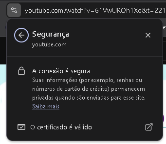

fonte: cartilha.cert.br

aulas assistidas pelo canal Curso em video, no link: https://www.youtube.com/watch?v=UMJgG-hp0f8&list=PLHz_AreHm4dkYS6J9KeYgCCVpo5OXkvgE

Tema: Redes sociais

Algoritmo baseia no que você consome

Cuidado ao públicar coisas demais sobre si mesmo nas redes sociais, pois a exclusão de informações nas redes sociais são extremamente difíceis de serem apagadas por completo.

A venda dos seus dados são feitas e isso é aceito nos termos dentro da legalidade

Compra e venda de produtos na internet: sempre verificar a conta do usuário, se é bom movimentada, por bastante tempo e com boas avaliações.

Uma grande janela de negócio a internet.

* Perigos

- Furto de identidade
- Invasão de perfil
- Envio de fotos adultas para alguém
- Menores de idade que usam redes sociais precisam de supervisionamento dos responsáveis

Hackear instagram ou alguma rede é muito difícil diretamente, geralmente usam algum site falso, ou algum programa pirata que você baixou para coletar os dados.

Verificar o registro de atividades, é possível bloquear por ip caso haja alguma invasão

Em alguns casos, possível que a justiça consiga os dados da pessoa que causou algum problema a você, de invasão, perfil fake ou algo relacionado.

Verificar o certificado de segurança do navegador - 

Não confiar em anonimato oferecido por apps e sites

Sua senha pode vazar quando:
- Seu computador possuí vírus, ou com sites falsos(phishing)

