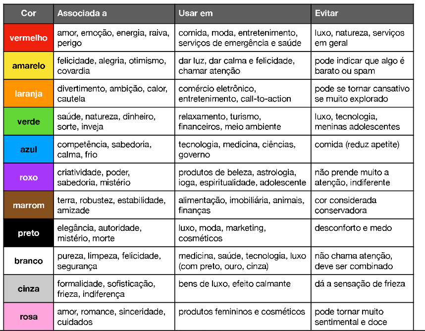
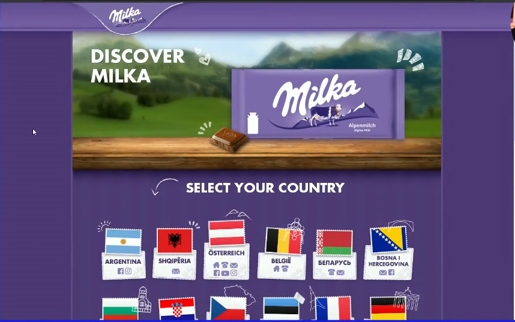
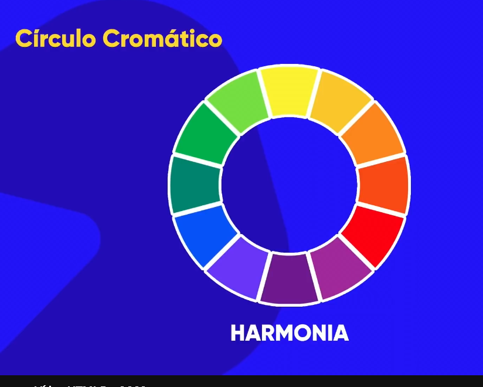
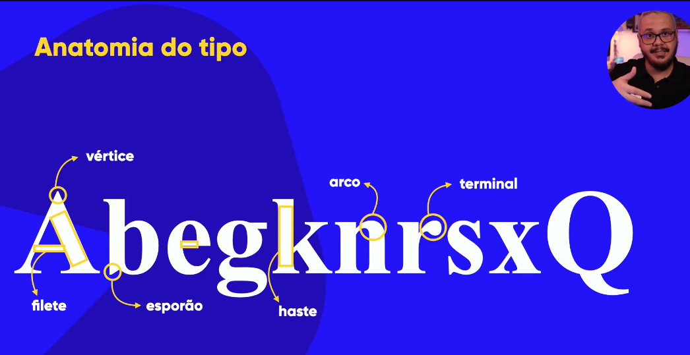
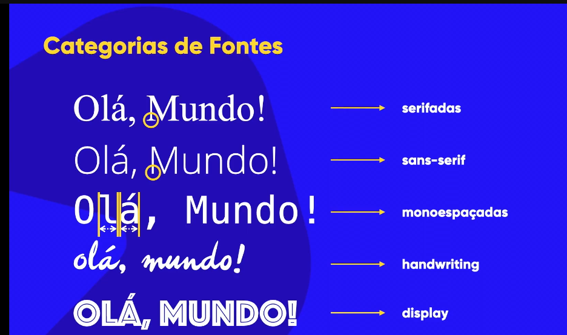

colocar o style abaixo do title, fica mais organizado deixar uma parte somente para style.

----------------------------------------------------------------------
CORES

  Psicologia das cores

  Nós, humanos, olhamos uma coisa e falamos, nossa que bonito e não sabe o porque. O conjunto e harmonia de cores faz com que desperte isso.

  Azul - Tecnologia (Competência, sabedoria, calma, confiança, profissionalismo, integridade, segurança.) A cor mais aceita do mundo (45%) e menor taxa de rejeição (1%)

  Vermelho - Amor, emoção, energia, raiva, perigo (comida, moda, entreterimento, saúde) evitar em luxo, natureza, serviços.

Imagem sobre cores.

Usar fundo preto com letras brancas ao ter pouco conteúdo a consumir, pois as letras brancas causam cansaço mental.

Exemplo:

Netflix pagina preto com letras brancas, porém ao ver os termos de uso é fundo branco letras pretas.

Exemplo da Milka também, site com varios tons de roxo

Rosa: produtos femininos e cosméticos.  (Evitar rosa ideia muito sentimental ou doce)

Referencia, paolakrauze.com (site profissional, usar como referencia.)

Marrom usado em restaurante frances, ideia de luxo.

Verde: natureza, saúde, tranquilidade, frescor, crescimento (ecologia, alimentos, medicina, bem estar)

Dourado

Decidir dois tons, ou um tom, e usar como marca, juntar com branco preto e cinza, dourado , bege.

SITES REFERENCIAS

calem.pt

recess site

https://kopkegroupwineshop.com/

cedricpereira.com

-----------------------------------------------------------------------------

Harmonia de cores

Circulo cromático

coisa cimétrica fica mais bonita, criar comodidade visual

Cores primarias: amarelo, vermelho e azul.  (tem uma harmonia meio grosseira)

Cores secundarias: verde, laranja e violeta. (mais harmonioso)

cores terciária: amarelo esverdeado, amarelo citado primeiro, pois é uma cor primaria. (tons pasteis)

temperatura de cores, cores frias e cores quentes.

Cores quentes: vermelho, laranja, amarelo (energia, ação, paixão, alegria)

Cores frias: azul, verde, violeta (calma, serenidade, paz, confiança)

Se preocupar muito com sua paleta de cores para criar o site, serviço, produto.

Exemplo:

Restaurante chique, elegante, haver com dourado, preto, marrom escuro. Usar cores e tons similares juntando com preto e branco.

A paleta tem de 3 a 5 cores no máximo, desconsiderando preto e branco.

O cliente tem uma logo e a marca, ver a cor primaria da marca e coisas relacionadas a marca dele.

Cores complementares:

Mais contraste entre si, marrom e escolher a cor oposta do ciruclo cromático.

Exemplo: violeta e amarelo.  Verde com vermelho.  Azul com laranja.

Cores análogas, não tem contraste mas são perceptíveis, pegar as cores vizinhas.

Cores análogas e complementar também tem um resultado. Geralmente tem ciência que fica confortável.

Cores análogas relacionadas: pegar uma primaria pular uma ao lado e pegar as duas seguintes.

cores intercaladas: amarelo, pular uma, e escolher a outra laranja, vermelho

Cores triádicas, usar uma como referencia e pular sempre três cores e pegar a outra, pular mais três e pegar outra.

Exemplo: vermelho, azul e amarelo.

quadrado, pular duas ate coletar 4.

cores tetrádicas. formar retângulo.

Monocromia, pegar a mesma cor e alterar brilho e saturação.

---------------------------------------------

Usei o adobe color para pegar referenciar ele cria a paleta

paletton

coolors.

extensão de navegador colorzilla pega o codigo da cor direto

---------------------------------------------

tipografia

- antigamente existia monge copista tinha o livro original e ele tinha que copiar o livro inteiro.

outro nome era amanuence (feito a mão) que era a única opção da época. então o nobre solicitava ele copiava o livro todo e demorava um ou dois mees para entregar.

Gutenberg (pai da imprensa) invertou a maquina prensa mecanica de tipos moveis era tipo um carimbão

dizem que foi inventado por chineses muito tempo antes.

a forma de escrever transmite emoções

julgam por imagem cor e boas letras

(se preocupar com o conteúdo também)

--------------------------
anatomia dos tipos

alura-x, altura das maiúsculas

ascendente o vazamento para cima, e para baixo é descendente

altura total é corpo

serifa traços parecidos da fonte

se tiver um texto com as palavras contendo a primeira e a ultima letra dela certa nosso cerebro le tudo certo em palavras de 4 letras ou mais

Anatomia do tipo imagem explicativa - 

categorias de fonte, serifada porque tem serifa

handwriting fonte é boa para simular a escritura a mão

dsplay não se baseia em nada ou pouco, fontes comemorativas, filmes, festas 

categorias de fontes imagem - 

----------------------------------------------------------------------------------------------------------------------------------

https://www.w3schools.com/cssref/css_websafe_fonts.php

peso da fonte - font-weight

para inserir valores em font-weight podemos, 100 - 900, lighte - bolder

mas muitas fontes não tem essa capacidade, fontes comuns como arial

shorthand font

- font-style -> font-weight -> font-syze -> font-family

fonts.google.com

existem varias extenções para consultar a fonte de um site, mas você baixou a fonts ninja

sites para consultar fontes de imagens

whatfontis / fontsquirrel / https://www.myfonts.com/pt/

Alinhamento: text-align: center; e text-indent: 30px; (para paragrafo)

----------------------------------------------------------------------------------------

colocar <h1 id="principal">Criando sites com HTML e CSS</h1>

para especificar o h1 e alterar somente 1

<h1 id="nome">Texto</h1>

para adicionar mais uma classe é só usar class="nome1 nome2"

id sobrepoe as configurações de class

